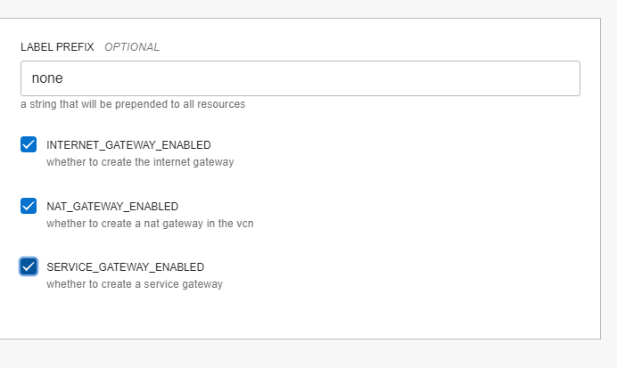
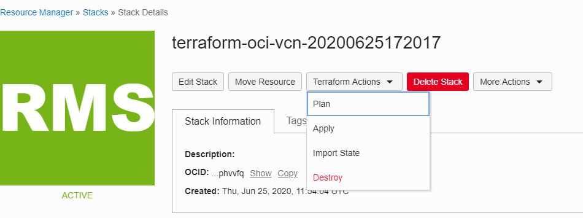
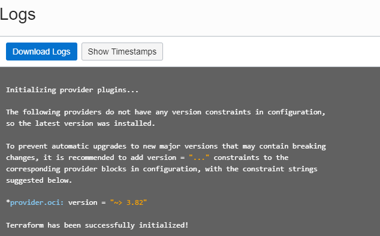

= Resource Manager

:idprefix:
:idseparator: -
:sectlinks:
:bl: pass:[ +]

:uri-rm-overview: https://docs.cloud.oracle.com/en-us/iaas/Content/ResourceManager/Concepts/resourcemanager.htm
:uri-rm-stack: https://docs.cloud.oracle.com/en-us/iaas/Content/ResourceManager/Tasks/managingstacksandjobs.htm

. {uri-rm-overview}[Overview]
. {uri-rm-stack}[Create Stack]
. Step by Step Instructions

+
[source,bash]
----
git clone https://github.com/oracle-terraform-modules/terraform-oci-vcn.git

zip terraform-oci-vcn.zip *.tf schema.yaml -x main.tf

----

.Create Stack
image::images/createstack.PNG[align="center",width=640,height=480]

{bl}

.Upload zip file and select 0.12.x for Terraform version
image::images/uploadzip.PNG[align="center",width=640,height=480]

{bl}

.Configure variables as per your need
image::images/variable1.PNG[align="center",width=640,height=480]

{bl}

.Check the boxes if you need gateways

{bl}

.Stack Review
image::images/review.PNG[align="center",width=640,height=480]

{bl}

.Terraform plan and then apply to create resource

{bl}

.Logs
