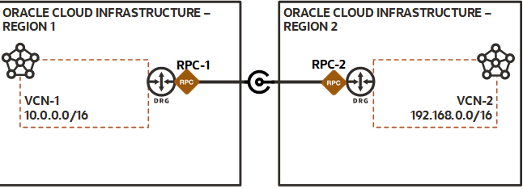

# Creating a remote VCN peering using RPCs with terraform-oci-vcn

[Terraform Variable Definition file]:https://www.terraform.io/docs/language/values/variables.html#variable-definitions-tfvars-files
[Input Variables]:https://www.terraform.io/docs/language/values/variables.html
[Local Values]:https://www.terraform.io/docs/language/values/locals.html
[Named Values]:https://www.terraform.io/docs/language/expressions/references.html
[docs/prerequisites]:https://github.com/oracle-terraform-modules/terraform-oci-vcn/blob/main/docs/prerequisites.adoc
[docs/terraformoptions]:https://github.com/oracle-terraform-modules/terraform-oci-vcn/blob/main/docs/terraformoptions.adoc
[docs/routing_rules]:https://github.com/oracle-terraform-modules/terraform-oci-vcn/blob/main/docs/routing_rules.adoc
[Provisioning Infrastructure with Terraform]:https://www.terraform.io/docs/cli/run/index.html

This example illustrates how to use terraform-oci-vcn to create a remote VCN peering between VCNs created in different regions, using the Remote Peering Gateway.
> **Note:** This example is provide for backwards compatibility, using the vcn module to handle the DRG and RPC. For new projects you should use [this one](../rpc_from_drg_module/README.md)

In the acceptor region will be created: 
- a VCN, with a private subnet for each given CIDR block, and a NAT gateway
- a DRG attached to the VCN
- the route rules to allow traffic through the Peering

In the remote region will be created:
- a VCN with, a public subnet for each given CIDR block, and an Internet Gateway
- a DRG attached to the VCN
- the route rules to allow traffic through the Peering

This diagram illustrates what will be created by this example.



## Prerequisites

You will need to collect the following information before you start:

1. your OCI provider authentication values
2. a compartment OCID in which the present configuration will be created

For detailed instructions, see [docs/prerequisites]

## Using this example with Terraform CLI

### Creating Providers

You need to create 2 providers:
* 1 provider for the local region where all the local resources will be created 
* 1 provider for the remote region where all the remote resources will be created (alias: remote)

```
provider "oci" {
  fingerprint          = var.api_fingerprint
  private_key_path     = var.api_private_key_path
  region               = var.region_acceptor
  tenancy_ocid         = var.tenancy_id
  user_ocid            = var.user_id
  alias                = "acceptor"
}

provider "oci" {
  fingerprint          = var.api_fingerprint
  private_key_path     = var.api_private_key_path
  region               = var.region_requestor
  tenancy_ocid         = var.tenancy_id
  user_ocid            = var.user_id
  alias                = "requestor"
}
```

### Creating Terraform variables definition file

Prepare one [Terraform Variable Definition file] named terraform.tfvars with the required authentication information.

*TIP: You can rename and configure [terraform.tfvars.example](terraform.tfvars.example) from this example's folder.*

Then apply the example using the following commands:

```shell
> terraform init
> terraform plan
> terraform apply
```

See [Provisioning Infrastructure with Terraform] for more details about Terraform CLI and the available subcommands.
